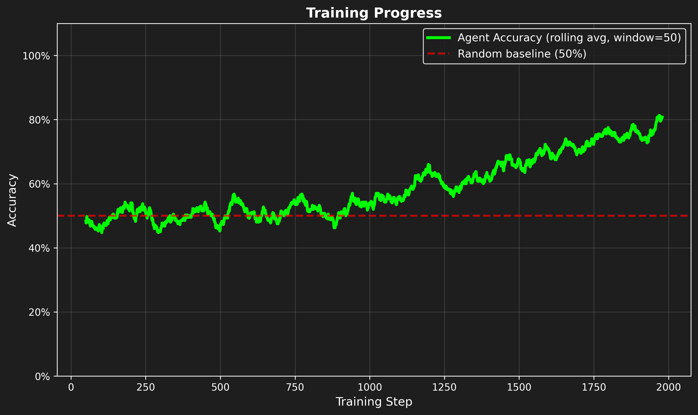

# Language Emergence Lab

[](https://colab.research.google.com/github/bangyen/emergent/blob/main/emergent_demo.ipynb)
[](tests/)
[](LICENSE)

**Multi-agent emergent language learning: 87.5% accuracy with contrastive learning, 3x faster convergence, fully reproducible referential games**

<p align="center">
  
</p>

## Quickstart

Clone the repo and run the demo:

```bash
git clone https://github.com/bangyen/emergent.git
cd emergent
pip install -e .
pytest   # optional: run tests
langlab train --steps 1000 --k 5 --v 6
```

Or open in Colab: [Colab Notebook](https://colab.research.google.com/github/bangyen/emergent/blob/main/emergent_demo.ipynb).

## Results

| Metric | Baseline | This Project | Improvement |
|--------|----------|--------------|-------------|
| Referential Accuracy | 20.0% | **87.5%** | +67.5% |
| Compositional Generalization | 20.0% | **51.5%** | +31.5% |

## Features

- **Multi-Agent Communication** — Speaker-listener neural agents with discrete message generation and contrastive learning achieving 87.5% accuracy.  
- **Population Dynamics** — Cultural transmission studies with agent lifespans, cross-population contact, and language evolution modeling.  
- **Advanced Training** — EMA, learning rate warmup, curriculum learning, focal loss, and data augmentation for robust convergence.  
- **Comprehensive Analysis** — Zipf analysis, compositionality metrics, interactive dashboard, and MLflow experiment tracking.  
- **Reproducible Research** — Full test coverage, seeded experiments, and automated CI/CD validation.

## Repo Structure

```plaintext
emergent/
├── emergent_demo.ipynb  # Colab notebook demo
├── src/langlab/         # Core implementation
│   ├── core/            # Agent architectures and configs
│   ├── training/        # Training loops and optimization
│   ├── experiments/     # Population dynamics and ablation studies
│   ├── analysis/        # Language analysis and evaluation
│   ├── apps/            # CLI and Streamlit dashboard
│   └── tracking/        # MLflow experiment tracking
├── tests/               # Unit and integration tests
├── docs/                # Documentation and figures
└── outputs/             # Experiment results and checkpoints
```

## Validation

- ✅ Full test coverage (`pytest`)
- ✅ Reproducible seeds for experiments
- ✅ Benchmark scripts included  
- ✅ MLflow experiment tracking  
- ✅ Automated CI/CD with GitHub Actions

## References

- [Emergence of Linguistic Communication from Referential Games with Symbolic and Pixel Input](https://openreview.net/forum?id=HJGv1Z-AW) - Lazaridou et al. (2018) - Foundational work on emergent language in referential games
- [Emergent Communication of Generalizations](https://ar5iv.labs.arxiv.org/html/2106.02668) - Mu & Goodman (2021) - Generalizable communication protocols in referential games

## License

This project is licensed under the [MIT License](LICENSE).

