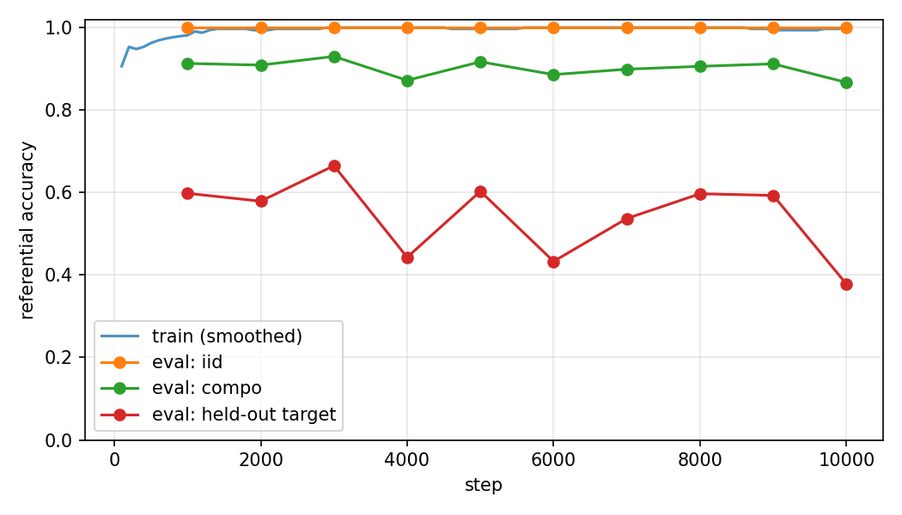

# Language Emergence Lab

[](https://colab.research.google.com/github/bangyen/emergent/blob/main/emergent_demo.ipynb)
[](https://github.com/bangyen/emergent/actions/workflows/ci.yml)
[](LICENSE)

**Multi-agent emergent language learning: Modular framework for studying communication protocols in fully reproducible referential games**

<p align="center">
  
</p>

## Quickstart

Clone the repo and run the demo:

```bash
git clone https://github.com/bangyen/emergent.git
cd emergent
pip install -e ".[analysis]"   # or: uv sync --extra dev
langlab train --steps 10000 --heldout red,circle   # writes outputs/metrics.csv + checkpoint
langlab eval --ckpt outputs/checkpoints/final_model.pt --split compo
langlab plot                                        # outputs/training_curve.png
```

Or open in Colab: [Colab Notebook](https://colab.research.google.com/github/bangyen/emergent/blob/main/emergent_demo.ipynb).

## Results

Defaults (`k=5` objects per scene, vocabulary 16, message length 2, 10k steps), holding out every red circle from training. Chance is 20%.

| Split | Accuracy (seeds 1, 2, 3, 7) |
|-------|------------------------------|
| IID (fresh scenes without held-out objects) | 97–100% |
| Compositional (scenes containing a held-out object) | 82–95% |

Reproduce with `langlab train --steps 10000 --heldout red,circle --seed <s>`.

## Features

- **Multi-Agent Communication** — Speaker and Listener agents exchange discrete messages; the Speaker is trained with REINFORCE (Gumbel-max sampling, moving-average baseline, entropy bonus), the Listener with cross-entropy.
- **Flexible Architectures** — MLP agents with residual connections and layer normalization, or GRU sequence agents (`--use-sequence-models`).
- **Compositional Generalization** — `--heldout` removes attribute combinations from the training stream; training periodically evaluates on fixed IID and compositional sets.
- **Reproducible Research** — Seeded scene streams and training, metrics logged to CSV.

## Repo Structure

```plaintext
emergent/
├── emergent_demo.ipynb  # Colab notebook demo
├── src/langlab/         # Core implementation
│   ├── core/            # Agent architectures and channel logic
│   ├── training/        # Training loop
│   ├── data/            # World generation and datasets
│   ├── analysis/        # Evaluation, plotting and reports (plotting needs the `analysis` extra)
│   ├── apps/            # CLI interface
│   └── utils/           # Shared utilities
├── tests/               # Unit and integration tests
├── docs/                # Documentation and figures
└── outputs/             # Experiment results and checkpoints
```

## Validation

- CI runs ruff, mypy and the test suite on Python 3.10–3.12, then a CLI smoke run (train → eval → plot)
- Test coverage above 80% (`pytest --cov=src`)

## References

- [Emergence of Linguistic Communication from Referential Games with Symbolic and Pixel Input](https://openreview.net/forum?id=HJGv1Z-AW) - Lazaridou et al. (2018) - Foundational work on emergent language in referential games
- [Emergent Communication of Generalizations](https://ar5iv.labs.arxiv.org/html/2106.02668) - Mu & Goodman (2021) - Generalizable communication protocols in referential games

## License

This project is licensed under the [MIT License](LICENSE).

