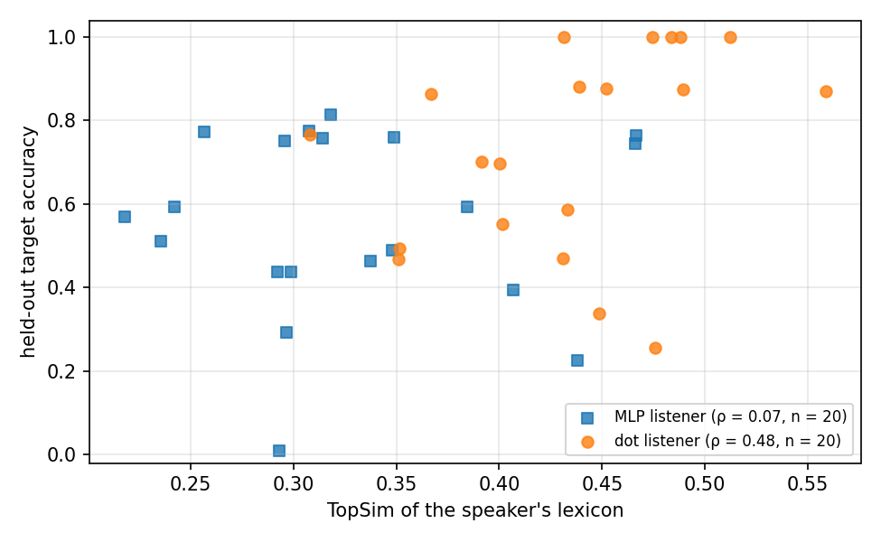

# Language Emergence Lab

[](https://colab.research.google.com/github/bangyen/emergent/blob/main/emergent_demo.ipynb)
[](https://github.com/bangyen/emergent/actions/workflows/ci.yml)
[](LICENSE)

**Multi-agent emergent language learning: Modular framework for studying communication protocols in fully reproducible referential games**

<p align="center">
  
</p>

## Quickstart

```bash
git clone https://github.com/bangyen/emergent.git
cd emergent
pip install -e ".[analysis]"   # or: uv sync --extra dev
langlab train --steps 10000 --heldout red,circle   # writes outputs/metrics.csv + checkpoint
langlab eval --ckpt outputs/checkpoints/final_model.pt --split compo_target
langlab plot                                        # outputs/training_curve.png
```

Or open in Colab: [Colab Notebook](https://colab.research.google.com/github/bangyen/emergent/blob/main/emergent_demo.ipynb).

## Results

Every red circle is held out of training (in the large world, every yellow star). 10k steps, `k=5` objects per scene so chance is 20%, vocabulary 16, message length 2; mean ± std over seeds 1–3.

<!-- results:start -->
| Run | Seeds | IID acc | Compo acc | Held-out target acc | Worst pair acc | Agreement | TopSim | PosDis | # messages |
|---|---|---|---|---|---|---|---|---|---|
| MLP | 3 | 99.5 ± 0.8% | 90.3 ± 3.2% | 56.4 ± 16.1% | – | – | 0.29 ± 0.02 | 0.19 ± 0.04 | 16.3 ± 1.2 |
| GRU | 3 | 99.5 ± 0.9% | 85.1 ± 3.4% | 34.5 ± 18.2% | – | – | 0.37 ± 0.08 | 0.12 ± 0.06 | 16.7 ± 0.6 |
| MLP, population of 3 with turnover | 3 | 94.0 ± 3.2% | 87.0 ± 2.3% | 57.1 ± 12.7% | 90.0 ± 6.5% | 3.1 ± 2.8% | 0.35 ± 0.04 | 0.20 ± 0.06 | 13.0 ± 2.1 |
| MLP, large world | 3 | 94.6 ± 1.6% | 93.3 ± 1.9% | 78.0 ± 5.5% | – | – | 0.39 ± 0.03 | 0.07 ± 0.08 | 52.3 ± 11.6 |
<!-- results:end -->

- **IID**: fresh scenes with no held-out objects. **Compo**: scenes that *contain* a held-out object. **Held-out target**: the target itself is a held-out object — the strict compositional test.
- **TopSim** / **PosDis**: topographic similarity and positional disentanglement of the speaker's lexicon (1.0 = perfectly compositional). **# messages**: distinct messages across all objects (18 in the default world, 225 in the large one).
- **Population only**: accuracy is averaged over every speaker × listener pair; **worst pair** is the weakest pair and **agreement** is how often two speakers use the same message for an object.

What this shows:

- Agents almost always solve the game on familiar objects, but the strict test tells a different story: when the target is an unseen combination, accuracy drops to 35–57% in the default world. The looser "compo" score (85–90%) hides this, because most of those scenes can be solved without naming the held-out object.
- The languages are only weakly compositional (TopSim ≈ 0.3–0.4).
- The large world generalizes better (78% on held-out targets), which fits the idea that more combinations push the agents toward compositional codes.
- In populations, speakers almost never agree on messages (about 3%), yet every listener understands every speaker (the worst pair still scores 90%). The listeners become multilingual rather than the community converging on one language.

Regenerate this table with `langlab sweep experiments/readme.json --jobs 4 --readme README.md`.

## Experiments

Each table below is written by `langlab sweep experiments/<name>.json --readme README.md`. Mean ± std over seeds. Every red circle is held out of training.

### Why do agents fail on unseen combinations?

<!-- generalization:start -->
| Run | Seeds | IID acc | Compo acc | Held-out target acc | TopSim | PosDis | # messages |
|---|---|---|---|---|---|---|---|
| baseline | 3 | 100.0 ± 0.0% | 89.8 ± 4.6% | 55.3 ± 17.8% | 0.31 ± 0.02 | 0.16 ± 0.05 | 16.7 ± 1.2 |
| vocab 8 | 3 | 99.4 ± 1.1% | 92.5 ± 1.9% | 66.9 ± 8.7% | 0.32 ± 0.05 | 0.07 ± 0.09 | 16.7 ± 1.2 |
| vocab 32 | 3 | 99.5 ± 0.9% | 92.1 ± 1.0% | 64.5 ± 3.9% | 0.34 ± 0.10 | 0.09 ± 0.04 | 16.3 ± 1.5 |
| message length 3 | 3 | 100.0 ± 0.0% | 92.4 ± 4.4% | 64.6 ± 20.3% | 0.40 ± 0.06 | 0.10 ± 0.02 | 17.3 ± 0.6 |
| 10 objects per scene | 3 | 97.3 ± 2.5% | 90.0 ± 3.6% | 32.4 ± 26.9% | 0.35 ± 0.01 | 0.15 ± 0.06 | 16.0 ± 0.0 |
| 4 hard distractors | 3 | 97.8 ± 2.2% | 91.1 ± 3.1% | 64.5 ± 16.5% | 0.28 ± 0.04 | 0.06 ± 0.07 | 15.0 ± 1.0 |
| 30k steps | 3 | 100.0 ± 0.0% | 94.7 ± 0.3% | 77.1 ± 1.6% | 0.31 ± 0.06 | 0.15 ± 0.06 | 17.0 ± 1.0 |
| dot listener | 3 | 100.0 ± 0.0% | 95.1 ± 4.4% | 80.9 ± 23.1% | 0.46 ± 0.05 | 0.16 ± 0.18 | 17.3 ± 0.6 |
| dot listener, 30k steps | 3 | 100.0 ± 0.0% | 91.5 ± 3.5% | 68.9 ± 30.1% | 0.40 ± 0.02 | 0.15 ± 0.09 | 17.7 ± 0.6 |
<!-- generalization:end -->

- **With the default listener, only longer training clearly helps** (55% → 77% at 30k steps). Vocabulary size, message length, scene size and hard distractors all stay within the variation between seeds.
- **The listener is a bottleneck.** `python experiments/oracle_listener.py` replaces the speaker with a perfectly compositional oracle and trains only the listener. The default MLP listener still gets **46 ± 38%** on held-out targets. The additive dot-product listener (`--listener-type dot`), which scores a candidate as a sum of (token, attribute value) terms, gets **100%**.
- **With learned agents, the dot listener helps on average but varies a lot between seeds.** Some seeds reach 100% and others stay near 30–50%, which is what the next experiment looks into.

### Does compositionality predict generalization?

<!-- compositionality:start -->
| Run | Seeds | IID acc | Held-out target acc | TopSim | PosDis | # messages |
|---|---|---|---|---|---|---|
| dot listener | 20 | 99.8 ± 0.5% | 73.5 ± 24.0% | 0.43 ± 0.06 | 0.12 ± 0.09 | 17.2 ± 0.8 |
| MLP listener | 20 | 99.8 ± 0.6% | 55.8 ± 21.9% | 0.33 ± 0.07 | 0.12 ± 0.06 | 16.3 ± 0.9 |
<!-- compositionality:end -->

<p align="center">
  
</p>

- **Correlation:** with the dot listener, the speaker's TopSim correlates with held-out accuracy (Spearman ρ = 0.48, p ≈ 0.03, n = 20). With the MLP listener it doesn't (ρ = 0.07).
- **Accuracy:** the dot listener raises mean held-out accuracy from 56% to 74%.
- **Speaker:** the dot listener also leads to more compositional speakers (TopSim 0.33 → 0.43).
- **Interpretation:** whether compositionality pays off depends on whether the listener can exploit it. This agrees with Rita et al. (2022), who find that the listener's co-adaptation controls the link between TopSim and generalization. It may also help explain why earlier work disagrees on whether compositionality and generalization are related (Chaabouni et al. 2020; Kharitonov & Baroni 2020; Auersperger & Pecina 2022).

Plot: `python experiments/plot_compositionality.py outputs/sweeps/compositionality`.

### Populations and iterated learning

<!-- population:start -->
| Run | Seeds | IID acc | Worst pair acc | Held-out target acc | Agreement | TopSim (1st eval) | TopSim | PosDis |
|---|---|---|---|---|---|---|---|---|
| 3 pairs, no turnover | 3 | 95.6 ± 2.5% | 90.7 ± 6.7% | 44.0 ± 18.1% | 4.3 ± 4.7% | 0.35 ± 0.04 | 0.36 ± 0.04 | 0.13 ± 0.05 |
| 3 pairs, turnover every 2500 | 3 | 98.1 ± 1.1% | 96.0 ± 2.7% | 36.6 ± 16.2% | 3.1 ± 2.1% | 0.35 ± 0.04 | 0.36 ± 0.04 | 0.11 ± 0.06 |
| 3 pairs, turnover every 1000 | 3 | 91.8 ± 0.6% | 88.5 ± 0.9% | 36.2 ± 6.1% | 8.0 ± 4.3% | 0.35 ± 0.02 | 0.34 ± 0.03 | 0.19 ± 0.03 |
| 5 pairs, turnover every 2500 | 3 | 93.8 ± 1.4% | 88.2 ± 3.6% | 38.8 ± 3.5% | 3.5 ± 1.8% | 0.34 ± 0.06 | 0.38 ± 0.02 | 0.20 ± 0.04 |
| 3 speakers, 1 shared listener | 3 | 97.9 ± 0.2% | 96.1 ± 1.1% | 55.5 ± 10.8% | 3.1 ± 1.1% | 0.37 ± 0.04 | 0.38 ± 0.09 | 0.13 ± 0.07 |
| 1 pair chain, turnover every 2500 | 3 | 99.4 ± 1.0% | 99.4 ± 1.0% | 64.6 ± 9.3% | – | 0.30 ± 0.04 | 0.37 ± 0.05 | 0.07 ± 0.01 |
| 3 pairs, vocab 5 | 3 | 88.4 ± 1.4% | 82.7 ± 4.2% | 38.1 ± 10.8% | 36.4 ± 7.0% | 0.36 ± 0.10 | 0.38 ± 0.06 | 0.24 ± 0.02 |
| 3 speakers, 1 shared listener, vocab 5 | 3 | 89.3 ± 1.4% | 81.8 ± 4.8% | 46.9 ± 3.4% | 22.2 ± 4.9% | 0.25 ± 0.02 | 0.30 ± 0.09 | 0.18 ± 0.08 |
| 1 pair, vocab 5 (reference) | 3 | 98.5 ± 0.5% | 98.5 ± 0.5% | 39.6 ± 24.9% | – | 0.27 ± 0.07 | 0.38 ± 0.07 | 0.09 ± 0.12 |
<!-- population:end -->

- **Turnover does not make the language more compositional here.** TopSim ends where it started in populations (≈0.35). A single-pair chain rises from 0.30 to 0.37, which is within the variation between seeds.
- **Spare message space lets speakers keep separate languages.** With 256 possible messages for 18 objects, speakers rarely use the same message for an object (3–8%), even when they share one listener. The listener simply learns every speaker's language.
- **A tight vocabulary forces convergence, at a cost.** With 25 messages, agreement rises to 22–36% (random choice would give about 4%), while accuracy drops to about 89%, against 98.5% for a single pair with the same vocabulary. This relates to capacity-pressure work such as Resnick et al. (2020).

## Features

- **Multi-Agent Communication** — Speaker and Listener agents exchange discrete messages; the Speaker is trained with REINFORCE (Gumbel-max sampling, moving-average baseline, entropy bonus), the Listener with cross-entropy.
- **Flexible Architectures** — MLP agents with residual connections and layer normalization, or GRU sequence agents (`--use-sequence-models`).
- **Compositional Generalization** — `--heldout` removes attribute combinations from the training stream; training periodically evaluates on IID, compositional and held-out-target sets.
- **Language Metrics** — topographic similarity, positional disentanglement, message entropy and lexicon size, logged at every evaluation.
- **Populations** — `langlab pop-train` trains speakers and listeners in random pairings, with optional generational turnover (`--lifespan`).
- **Pragmatics** — `langlab eval --split distractor --pragmatic` evaluates an RSA pragmatic listener on scenes with similar distractors.
- **Worlds** — `--world large` switches from 18 objects (3 colours × 3 shapes × 2 sizes) to 225 (5 × 5 × 3 × 3 textures).
- **Sweeps** — `langlab sweep config.json` runs variants × grid × seeds, resumes interrupted runs, and aggregates results into a Markdown/CSV table.

## Roadmap

Done:

- [x] Language structure metrics (TopSim, PosDis, message entropy)
- [x] Strict compositional split where the target itself is held out
- [x] Pragmatic listener and distractor scenes wired into `eval`; unused channel code removed
- [x] Tuned GRU sequence agents (entropy weight 0.05 brings them level with the MLP on IID accuracy)
- [x] Config-driven sweeps that regenerate the results table
- [x] Configurable attribute spaces (`--world large`)
- [x] Population training with generational turnover

- [x] Diagnosed the held-out-target gap (the listener architecture) and added an additive listener
- [x] Iterated-learning and population-convergence experiments
- [x] 20-seed test of whether compositionality predicts generalization

Next:

- [ ] Compare the additive listener with listener resets or other ways of limiting co-adaptation (Rita et al. 2022)
- [ ] More seeds and a larger world for the population results (currently 3 seeds each)
- [ ] Variable-length messages with an end-of-sequence token and a length cost
- [ ] Pixel inputs in place of one-hot attribute vectors

## Repo Structure

```plaintext
emergent/
├── emergent_demo.ipynb  # Colab notebook demo
├── src/langlab/         # Core implementation
│   ├── core/            # Agent architectures and channel logic
│   ├── training/        # Training loop, population training, sweeps
│   ├── data/            # World generation and datasets
│   ├── analysis/        # Evaluation, language metrics, reports, plotting (needs the `analysis` extra)
│   ├── apps/            # CLI interface
│   └── utils/           # Shared utilities
├── experiments/         # Sweep configs and diagnostic scripts behind the README tables
├── tests/               # Unit and integration tests
├── docs/                # Documentation and figures
└── outputs/             # Experiment results and checkpoints
```

## Validation

- CI runs ruff, mypy and the test suite on Python 3.10–3.12, then a CLI smoke run (train → eval → plot)
- Test coverage above 80% (`pytest --cov=src`)

## References

- [Emergence of Linguistic Communication from Referential Games with Symbolic and Pixel Input](https://openreview.net/forum?id=HJGv1Z-AW) - Lazaridou et al. (2018) - Foundational work on emergent language in referential games
- [Compositionality and Generalization in Emergent Languages](https://arxiv.org/abs/2004.09124) - Chaabouni et al. (2020) - Positional disentanglement and generalization
- [Emergent Language Generalization and Acquisition Speed are not tied to Compositionality](https://arxiv.org/abs/2004.03420) - Kharitonov & Baroni (2020)
- [Defending Compositionality in Emergent Languages](https://arxiv.org/abs/2206.04751) - Auersperger & Pecina (2022)
- [Emergent Communication: Generalization and Overfitting in Lewis Games](https://arxiv.org/abs/2209.15342) - Rita et al. (2022) - Listener co-adaptation and generalization
- [Structural Inductive Biases in Emergent Communication](https://arxiv.org/abs/2002.01335) - Słowik et al. (2020)
- [Capacity, Bandwidth, and Compositionality in Emergent Language Learning](https://arxiv.org/abs/1910.11424) - Resnick et al. (2020)
- [Emergent Communication of Generalizations](https://ar5iv.labs.arxiv.org/html/2106.02668) - Mu & Goodman (2021) - Generalizable communication protocols in referential games

## License

This project is licensed under the [MIT License](LICENSE).

